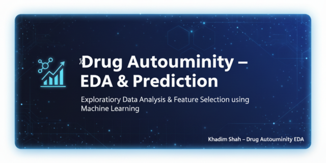
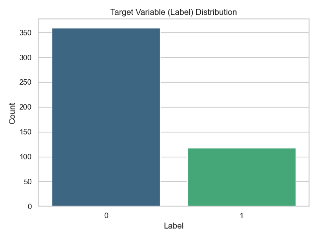
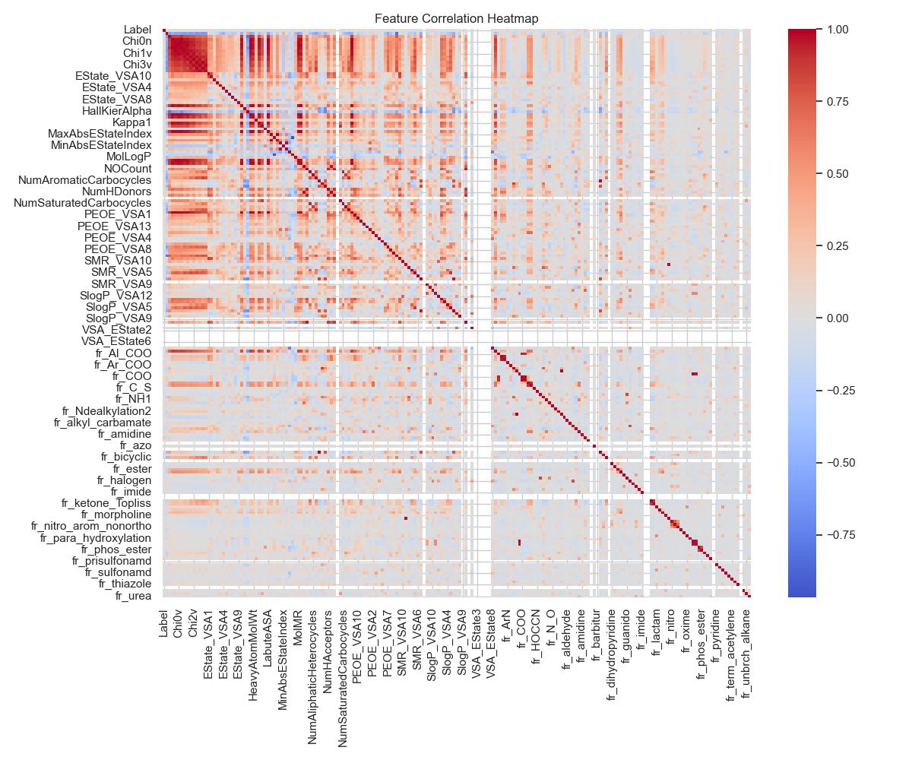
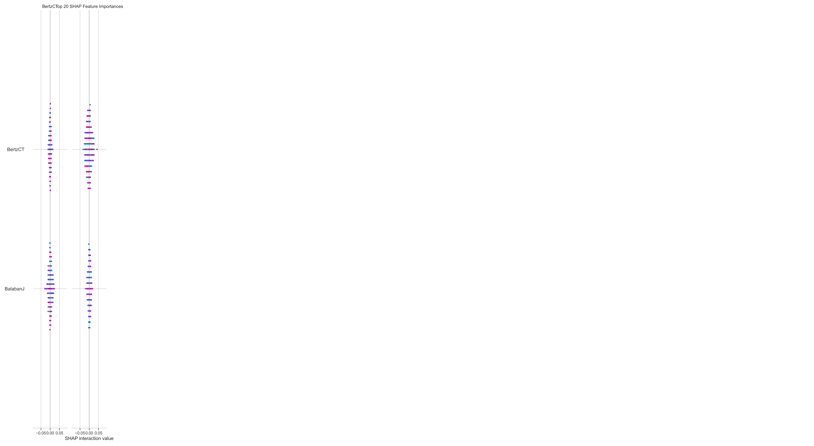

  

  
  
  
  
  

# 🧬 Drug Autoimmunity — Exploratory Data Analysis & Prediction

This project explores **drug-induced autoimmunity** using advanced data analysis and machine learning.  
It performs **Exploratory Data Analysis (EDA)**, **feature selection**, and **predictive modeling** using molecular descriptors from **RDKit**.

---

## 🚀 Project Overview
This project demonstrates a full workflow for molecular data science — from data cleaning to model explainability.

**Key Objectives:**
- 🧹 Clean and preprocess RDKit descriptor datasets  
- 📊 Perform EDA with correlations, distributions, and variance checks  
- 🤖 Build baseline Random Forest models for binary classification  
- 🧠 Use SHAP values for interpretability and feature importance visualization  

All visual outputs are saved automatically to `reports/figures/`.

---

## 🧠 Key Highlights
✅ Comprehensive and reproducible EDA  
✅ Feature selection using RFE and SHAP  
✅ High-quality, publication-ready visualizations  
✅ Professional project structure for GitHub portfolios  

---

## 📂 Repository Structure

drug_autoimmunity_eda/
│
├── data/
│ ├── DIA_trainingset_RDKit_descriptors.csv
│ ├── DIA_testset_RDKit_descriptors.csv
│ └── final_cleaned_dataset.csv
│
├── notebooks/
│ └── 01_EDA.ipynb
│
├── reports/
│ ├── figures/
│ │ ├── banner_drug_autoimmunity.png
│ │ ├── label_distribution.png
│ │ ├── correlation_heatmap.png
│ │ ├── feature_importance.png
│ │ ├── shap_feature_importance.png
│ │ └── confusion_matrix.png
│ └── top_features_rfe.csv
│
├── requirements.txt
└── README.md

yaml
Copy code

---

## ⚙️ Installation & Setup

bash
# 1️⃣ Clone this repository
git clone https://github.com/khadim-shah/drug_autoimmunity_eda.git
cd drug_autoimmunity_eda

# 2️⃣ Create and activate a Conda environment
conda create -n drug_autoimmune python=3.10 -y
conda activate drug_autoimmune

# 3️⃣ Install dependencies
pip install -r requirements.txt
# or (recommended)
conda install -c conda-forge rdkit -y

# 4️⃣ Run the notebook
jupyter notebook notebooks/01_EDA.ipynb
📊 Results & Visualizations

  
 
  
 
  
 
  

🧰 Tech Stack
Tool	Purpose
🐍 Python 3.10	Core language
🧮 Pandas / NumPy	Data manipulation
📊 Matplotlib / Seaborn	Visualization
🤖 Scikit-learn	Machine learning
⚗️ RDKit	Chemical descriptor generation
🔍 SHAP	Model explainability

🧑‍💻 Author
Khadim Shah
📧 khadimshahswt@gmail.com
🔗 LinkedIn
🧬 ORCID
🐙 GitHub

🏁 Next Steps
⚡ Add XGBoost and LightGBM models

🌐 Develop a Streamlit dashboard

🚀 Deploy for real-time predictions

📜 License
This project is licensed under the MIT License — see the LICENSE file for details.

🙌 Acknowledgements
RDKit community for cheminformatics tools

Scikit-learn developers for ML utilities

SHAP team for explainability frameworks

🌐 Connect With Me

  &nbsp;&nbsp;  &nbsp;&nbsp;  &nbsp;&nbsp;  

 ⭐ If you found this project helpful, please consider starring the repository!  © 2025 <b>Khadim Shah</b> — All Rights Reserved. 
